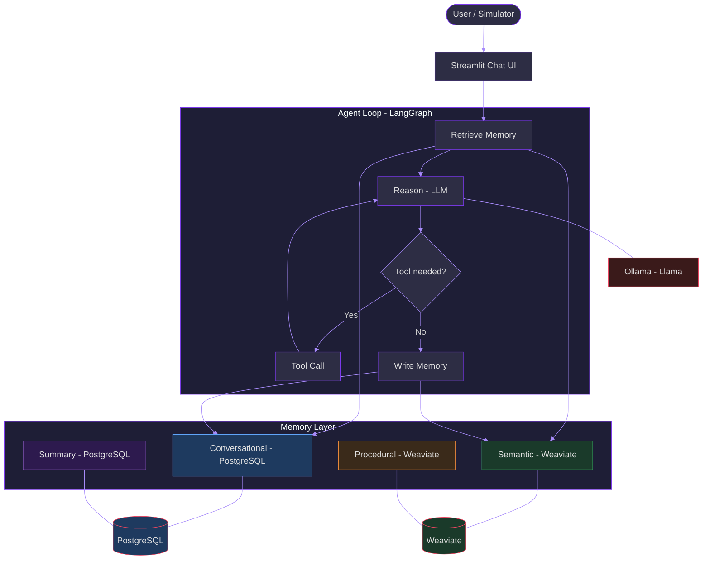

# Memory-Aware Regulatory Agent

> A Q&A agent with structured memory for regulatory documentation, built with LangGraph, PostgreSQL, Weaviate, and Ollama.

[](https://github.com/brunoramosmartins/memory-agent-regulatory/actions/workflows/ci.yml)


## Problem

Traditional RAG systems are **stateless**: every query starts from scratch, ignoring prior interactions. This leads to inconsistent answers across sessions, redundant retrievals, and inability to learn from conversation context. For regulatory domains where precision and consistency matter, this is a significant limitation.

## Approach

This project adds a **structured memory layer** on top of RAG, enabling the agent to:

- **Remember** past conversations (episodic memory via PostgreSQL)
- **Learn** semantic patterns across sessions (vector memory via Weaviate)
- **Reuse** proven workflow patterns (procedural memory)
- **Compress** long histories into summaries (summary memory)

A LangGraph state graph orchestrates retrieval, reasoning, tool use, and memory persistence in a cyclic agent loop.

## Architecture



## Key Results

| Metric | Description |
|--------|-------------|
| **Consistency Score** | Cross-session response similarity by topic |
| **Context Reuse Rate** | Fraction of turns leveraging stored memory |
| **Token Efficiency** | Baseline tokens / memory tokens ratio |
| **Retrieval Precision** | Relevant docs / retrieved docs per query |
| **Latency Impact** | Avg, P50, P95 latency comparison |

> Run `python scripts/run_evaluation.py --generate` to reproduce results. See [Evaluation Methodology](docs/EVALUATION.md) for details.

## Tech Stack

| Component | Technology | Purpose |
|-----------|-----------|---------|
| Orchestration | LangGraph | Agent state graph with cyclic reasoning |
| LLM | Llama 3.2 (Ollama) | Local inference, no API keys |
| Vector DB | Weaviate | Semantic + procedural memory (BGE-M3 1024d) |
| Relational DB | PostgreSQL | Conversational memory + summaries |
| Embeddings | BGE-M3 | Multilingual embeddings (1024 dimensions) |
| UI | Streamlit | Chat interface + memory visualization |
| Evaluation | Custom engine | 5 metrics, baseline vs memory comparison |
| CI | GitHub Actions | ruff lint + pytest on every push |

## Quick Start

```bash
# 1. Clone and setup
git clone https://github.com/brunoramosmartins/memory-agent-regulatory.git
cd memory-agent-regulatory
python -m venv .venv && source .venv/bin/activate  # or .venv\Scripts\activate on Windows
pip install -r requirements.txt

# 2. Start infrastructure
cp .env.example .env          # Fill in POSTGRES_PASSWORD
docker compose up -d          # PostgreSQL + Weaviate

# 3. Run database migrations
export POSTGRES_PASSWORD=your_password  # or set in .env
alembic upgrade head

# 4. Run tests
pytest tests/unit/ -v

# 5. Launch the UI
streamlit run app/main.py

# 6. Run evaluation
python scripts/run_evaluation.py --generate
```

## Repository Structure

```
memory-agent-regulatory/
├── app/                        # Streamlit UI
│   ├── main.py                 # Chat interface + memory sidebar
│   └── pages/
│       ├── evaluation.py       # Evaluation dashboard with charts
│       └── memory_explorer.py  # Browse memories by type/thread
├── src/
│   ├── agent/                  # LangGraph orchestration
│   │   ├── graph.py            # StateGraph definition + run_agent()
│   │   ├── nodes.py            # retrieve, reason, tool_call, write
│   │   ├── state.py            # AgentState dataclass
│   │   └── tools.py            # Tool registry (calculate, search)
│   ├── memory/                 # Structured memory layer
│   │   ├── manager.py          # MemoryManager facade
│   │   ├── conversational.py   # PostgreSQL episodic store
│   │   ├── semantic.py         # Weaviate vector memory
│   │   ├── procedural.py       # Trigger-action patterns
│   │   └── summary.py          # Session summaries
│   ├── ingestion/              # Multi-source document ingestion
│   │   ├── pdf_loader.py       # PyMuPDF extraction
│   │   ├── web_scraper.py      # BeautifulSoup scraping
│   │   ├── chunker.py          # Text chunking with overlap
│   │   └── source_registry.py  # Factory pattern router
│   ├── evaluation/             # Evaluation engine
│   │   ├── metrics.py          # 5 metric functions
│   │   ├── runner.py           # Dual-pipeline orchestrator
│   │   └── report.py           # Markdown + JSON reports
│   ├── simulation/             # Synthetic session generation
│   ├── retrieval/              # Hybrid search + reranking
│   ├── rag/                    # Context Builder
│   └── config/                 # Pydantic Settings
├── tests/                      # Unit + integration tests
├── scripts/                    # CLI scripts
├── migrations/                 # Alembic migrations
├── docs/
│   ├── ARCHITECTURE.md         # System design
│   ├── DECISIONS.md            # Architecture Decision Records
│   └── EVALUATION.md           # Evaluation methodology
├── docker-compose.yml
├── Makefile
└── pyproject.toml
```

## Roadmap

| Phase | Name | Status |
|-------|------|--------|
| 0 | Baseline RAG Hardening | Done |
| 1 | Memory Layer | Done |
| 2 | Memory Manager | Done |
| 3 | Agent Loop | Done |
| 4 | Multi-Source Ingestion | Done |
| 5 | Simulation Engine | Done |
| 6 | Evaluation Engine | Done |
| 7 | Productization | Done |

## Documentation

- [Architecture](docs/ARCHITECTURE.md) — System design and component details
- [Decisions](docs/DECISIONS.md) — Architecture Decision Records (ADRs)
- [Evaluation](docs/EVALUATION.md) — Methodology and metrics

## Lessons Learned

1. **Memory matters**: Even simple conversational memory significantly reduces redundant context in multi-turn sessions
2. **Facade pattern pays off**: The MemoryManager abstraction made it trivial to add new memory types without touching agent code
3. **Local LLMs have limits**: Llama 3.2 3B struggles with structured tool-call JSON; larger models or fine-tuning would help
4. **Token budgeting is critical**: Priority-based allocation (summary > history > semantic) prevents context overflow
5. **Synthetic evaluation is useful but limited**: Template-based sessions test memory mechanics well, but real user diversity would reveal more edge cases

## License

MIT
