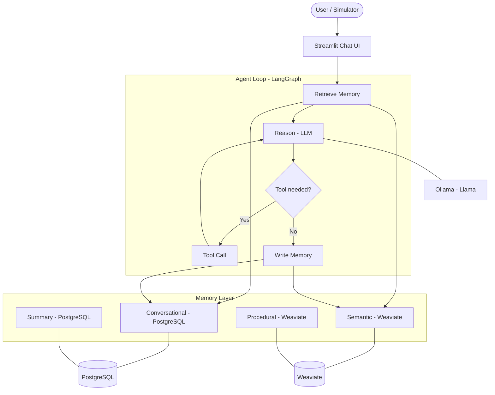

# Memory-Aware Regulatory Agent

> A Q&A agent with structured memory for regulatory documentation, built with LangGraph, PostgreSQL, Weaviate, and Ollama.

[](https://github.com/brunoramosmartins/memory-agent-regulatory/actions/workflows/ci.yml)


## Problem

Traditional RAG systems are stateless: every query starts from scratch, ignoring prior interactions. This leads to inconsistent answers across sessions, redundant retrievals, and inability to learn from conversation context. For regulatory domains where precision and consistency matter, this is a significant limitation.

## Approach

This project adds a **structured memory layer** on top of RAG, enabling the agent to:

- **Remember** past conversations (episodic memory via PostgreSQL)
- **Learn** semantic patterns across sessions (vector memory via Weaviate)
- **Reuse** proven workflow patterns (procedural memory)
- **Compress** long histories into summaries (summary memory)

A LangGraph state graph orchestrates retrieval, reasoning, tool use, and memory persistence in a cyclic agent loop.

## Architecture



## Tech Stack

| Component | Technology | Purpose |
|-----------|-----------|---------|
| Orchestration | LangGraph | Agent state graph with cyclic reasoning |
| LLM | Llama (Ollama) | Local inference, no API keys |
| Vector DB | Weaviate | Semantic memory + document retrieval |
| Relational DB | PostgreSQL | Conversational memory + summaries |
| Observability | OpenTelemetry + Phoenix | Tracing, structured logs |
| UI | Streamlit | Chat interface + memory visualization |
| Linting | ruff | Fast Python linter/formatter |
| Type checking | mypy | Static type analysis |

## Quick Start

```bash
cp .env.example .env          # Fill in POSTGRES_PASSWORD
make up                       # Start Weaviate + PostgreSQL
make test                     # Run unit tests
```

## Repository Structure

```
memory-agent-regulatory/
├── src/
│   ├── agent/              # LangGraph orchestration (Phase 3)
│   ├── memory/             # Structured memory layer (Phase 1-2)
│   │   ├── manager.py      # MemoryManager — unified read/write facade
│   │   ├── conversational.py
│   │   ├── semantic.py
│   │   ├── procedural.py
│   │   └── summary.py
│   ├── ingestion/          # Multi-source document ingestion (Phase 4)
│   ├── retrieval/          # Hybrid search + reranking
│   ├── config/             # Pydantic Settings
│   ├── observability/      # OpenTelemetry + Phoenix
│   ├── vectorstore/        # Weaviate client
│   ├── rag/                # Context Builder
│   ├── simulation/         # Synthetic session generation (Phase 5)
│   └── evaluation/         # Metrics engine (Phase 6)
├── app/                    # Streamlit UI (Phase 7)
├── tests/                  # Unit, integration, e2e tests
├── scripts/                # Bootstrap, ingestion, evaluation scripts
├── migrations/             # Alembic database migrations
├── docker-compose.yml      # Weaviate + PostgreSQL
├── Makefile                # Dev commands: up, test, lint, format
└── pyproject.toml          # Project config, ruff, mypy, pytest
```

## Roadmap

| Phase | Name | Status |
|-------|------|--------|
| 0 | Baseline RAG Hardening | Done |
| 1 | Memory Layer | Done |
| 2 | Memory Manager | Done |
| 3 | Agent Loop | Planned |
| 4 | Multi-Source Ingestion | Planned |
| 5 | Simulation Engine | Planned |
| 6 | Evaluation Engine | Planned |
| 7 | Productization | Planned |

## License

MIT
